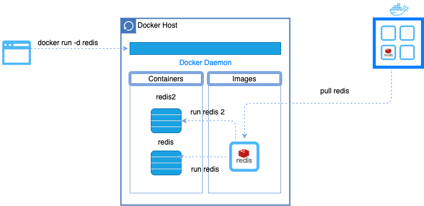
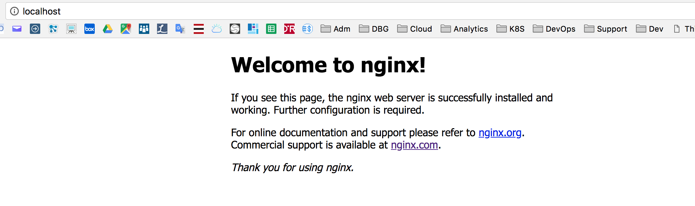
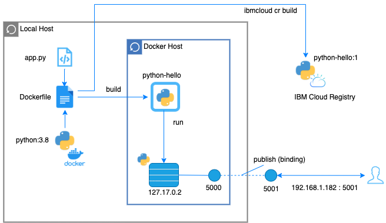
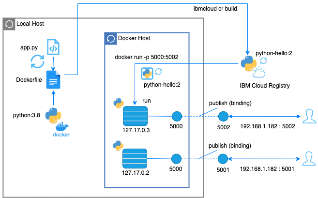

# IBM Kuberneteando sobre IBM Cloud Workshop
---
# Kuberneteando 2 Docker Hands On
---


Duration : 40 minutes

## Overview

In this lab, you will run your first Docker container.

Containers are just a process (or a group of processes) running in isolation. Isolation is achieved via linux namespaces and control groups. One thing to note, is that linux namespaces and control groups are features that are built into the linux kernel! Other than the linux kernel itself, there is nothing special about containers.

What makes containers useful is the tooling that surrounds it. For these labs, we will be using Docker, which has been the de facto standard tool for using containers to build applications. Docker provides developers and operators with a friendly interface to build, ship and run containers on any environment.

In this lab, we will run our first container, and learn how to inspect it. We will be able to witness the namespace isolation that we acquire from the linux kernel.

After we run our first container, we will dive into other uses of docker containers. We will find many examples of these on the Docker Store, and we will run several different types of containers on the same host. This will allow us to see the benefit of isolation- where we can run multiple containers on the same host without conflicts.

We will be using a few Docker commands in this lab. For full documentation on available commands check out the [official documentation](https://docs.docker.com/).

## Prerequisites
This set of instructions requires:
1.  Install Docker to run commands from a bash shell or a command line. You can get more information at the [Docker website](https://www.docker.com/get-docker). Alternatively, you can use [Play with Docker](http://play-with-docker.com).

2. Install the IBM Cloud CLI. https://cloud.ibm.com/docs/containers?topic=containers-cs_cli_install

3. Install the Container Registry plug-in
`ibmcloud plugin install container-registry -r 'IBM Cloud'`


## Task 1 - Working with Docker


### 1. Check Docker version

Launch a shell or a command line and confirm that docker is installed.

The version number isn't particularly important.
However, you can see both the client (CLI) and the server (engine).

`docker version`

Output:

```bash
# docker version
Client:
 Version:           18.06.2-ce
 API version:       1.38
 Go version:        go1.10.3
 Git commit:        6d37f41
 Built:             Sun Feb 10 03:48:06 2019
 OS/Arch:           linux/amd64
 Experimental:      false

Server:
 Engine:
  Version:          18.06.2-ce
  API version:      1.38 (minimum version 1.12)
  Go version:       go1.10.3
  Git commit:       6d37f41
  Built:            Sun Feb 10 03:46:30 2019
  OS/Arch:          linux/amd64
  Experimental:     false
```

The Docker version could be different. 


### 2. Run your first container

As with all new computer things, it is obligatory that we start with "hello-world"

`docker run hello-world`

Output:

```bash
# docker run hello-world
Unable to find image 'hello-world:latest' locally
latest: Pulling from library/hello-world
1b930d010525: Pull complete 
Digest: sha256:2557e3c07ed1e38f26e389462d03ed943586f744621577a99efb77324b0fe535
Status: Downloaded newer image for hello-world:latest

Hello from Docker!
This message shows that your installation appears to be working correctly.

To generate this message, Docker took the following steps:
 1. The Docker client contacted the Docker daemon.
 2. The Docker daemon pulled the "hello-world" image from the Docker Hub.
    (amd64)
 3. The Docker daemon created a new container from that image which runs the
    executable that produces the output you are currently reading.
 4. The Docker daemon streamed that output to the Docker client, which sent it
    to your terminal.

To try something more ambitious, you can run an Ubuntu container with:
 $ docker run -it ubuntu bash

Share images, automate workflows, and more with a free Docker ID:
 https://hub.docker.com/

For more examples and ideas, visit:
 https://docs.docker.com/get-started/
```

   

 > Notice the message `Unable to find image 'hello-world:latest' locally` First you see that the image was automatically downloaded without any additional commands. Second the version `:latest` was added to the name of the image. We did not specify a version for this image.


### 3. Rerun "hello-world" 

Notice that the image is not pulled down again. It already exists locally, so it is run.

`docker run hello-world`

Output:

```bash
# docker run hello-world

Hello from Docker!
This message shows that your installation appears to be working correctly.

To generate this message, Docker took the following steps:
 1. The Docker client contacted the Docker daemon.
 2. The Docker daemon pulled the "hello-world" image from the Docker Hub.
    (amd64)
 3. The Docker daemon created a new container from that image which runs the
    executable that produces the output you are currently reading.
 4. The Docker daemon streamed that output to the Docker client, which sent it
    to your terminal.

To try something more ambitious, you can run an Ubuntu container with:
 $ docker run -it ubuntu bash

Share images, automate workflows, and more with a free Docker ID:
 https://hub.docker.com/

For more examples and ideas, visit:
 https://docs.docker.com/get-started/
```


### 4.  Show the image

List all the images:

 `docker images hello-world`

Output:

```bash
# docker images
REPOSITORY          TAG                 IMAGE ID            CREATED             SIZE
hello-world         latest              fce289e99eb9        3 weeks ago         1.84kB
```


### 5. From where was the `hello-world` image pulled? 

Go to `https://hub.docker.com/_/hello-world/` and you can read about this image. Docker-hub is a registry that holds docker images for use. Docker-hub is not the only registry, IBM Cloud Public can serve as a docker registry. You can also have (or define) private registries.

 


### 6. Run a new container

This image is a typical image to get started with Docker. When an image is run it usually continues to run. 

The running image is called a **container**. Let us run a more typical image; This image contains the key-value database **redis**. As there is no image containing redis on your laptop, you will first pull it from the Docker Hub and then once all the layers have been downloaded and extracted, you will run it.

`docker run -d redis`

Output:

```bash
# docker run -d redis
Unable to find image 'redis:latest' locally
latest: Pulling from library/redis
54fec2fa59d0: Pull complete 
9c94e11103d9: Pull complete 
04ab1bfc453f: Pull complete 
a22fde870392: Pull complete 
def16cac9f02: Pull complete 
1604f5999542: Pull complete 
```

 The output above was captured while the image was still downloading from docker-hub. When the download is complete,  you don't see anything from the container, like with hello-world. Instead you see a long hex id like `c610107837e8d0785a05fb22f1bcc16b21ce9b0d4ee96e82a28267676e4a6c27`. **This is the long id of the container**.

```bash
Digest: sha256:399a9b17b8522e24fbe2fd3b42474d4bb668d3994153c4b5d38c3dafd5903e32
Status: Downloaded newer image for redis:latest
c610107837e8d0785a05fb22f1bcc16b21ce9b0d4ee96e82a28267676e4a6c27
```

Also notice that the -d in the run command with launch the container as **detached** and so you can get the prompt when the command has been completed.


### 7. Look at the running container

Notice only the first part of that long hex id is displayed. Typically this is more than enough to uniquely identify that container. `docker ps` provides information about when the container was created, how long it has been running, then name of the image as well as the name of the container. Note that each container must have a unique name. You can specify a name for each container as long as it is unique.

`docker ps | grep redis` 

Output:

```bash
# docker ps
CONTAINER ID        IMAGE               COMMAND                  CREATED             STATUS              PORTS               NAMES
c610107837e8        redis               "docker-entrypoint.s…"   9 minutes ago       Up 9 minutes        6379/tcp            modest_hugle
```

You will notice that the name is auto-generated by Docker:  **modest_hugle**. So to avoid this, a good practice is to always give a name to a container with the **--name** parameter.


### 8. An image can be run multiple times 

Launch another container for the redis image with a given name.

`docker run --name redis2 -d redis`

Output:

```bash
# docker run --name redis2 -d redis
b07714e7b548dbb0d3911bb6a18c85f6e1043a34978aa60e1b7fb34d6439d9a1
```

Did you notice how quickly the second instance started? There was no need to download the image this time. The id of the container is show after is has started. You can notice that we are reusing all the layers already downloaded when we first pull the image.


### 9. Two redis containers  

`docker ps | grep redis`

Output:

```bash 
# docker ps
CONTAINER ID        IMAGE               COMMAND                  CREATED              STATUS              PORTS               NAMES
b07714e7b548        redis               "docker-entrypoint.s…"   About a minute ago   Up About a minute   6379/tcp            redis2
c610107837e8        redis               "docker-entrypoint.s…"   13 minutes ago       Up 13 minutes       6379/tcp            modest_hugle
```


### 10. Similar redis instances 

The containers look similar, but they have unique names and unique ids. 

Stop the most recent container and then check to see what's running.

`docker stop c610107837e8 `

Output:

```bash
# docker stop c610107837e8
c610107837e8
```

Then check the container list. `-a` show all containers (default shows just running):

`docker ps -a`

Output:

```bash
# docker ps -a
CONTAINER ID        IMAGE               COMMAND                  CREATED             STATUS                     PORTS               NAMES
b07714e7b548        redis               "docker-entrypoint.s…"   5 minutes ago       Up 5 minutes               6379/tcp            redis2
c610107837e8        redis               "docker-entrypoint.s…"   17 minutes ago      Exited (0) 2 minutes ago                       modest_hugle
```

So we still have one running container.   


### 11. Stop the other container

Stop the other container and see what is running.

 `docker stop b07714e7b548`

 `docker ps | grep redis` or `docker ps`

Output:

```bash
# docker ps
CONTAINER ID        IMAGE               COMMAND             CREATED             STATUS              PORTS               NAMES
```

We have no more redis running constainer.

 

### 12. What about the images

 Notice that the images still exist.

 `docker images`

Output:

```bash
# docker images
REPOSITORY          TAG                 IMAGE ID            CREATED             SIZE
redis               latest              f9b990972689        13 days ago         104MB
hello-world         latest              fce289e99eb9        3 weeks ago         1.84kB
```

You can filter the images by they names : `docker images redis`   

  

### 13. Now remove the redis image 

Go ahead and delete the couchDB image and double check that it is gone.

` docker rmi redis`

Output:

```bash
# docker rmi redis
Error response from daemon: conflict: unable to remove repository reference "couchdb" (must force) - container 272d409a806c is using its referenced image f9b990972689

```

Apparently some stopped containers are still using this images and you can see the ids.

   

### 14. Oops, it is not working

We can't delete that image until we delete the "redis" containers (running or not).

> Remember that the `docker ps -a` will show us all the containers, not just the ones that are running but also the ones that stopped.
You will noticed that all containers that you are listing have been stopped. 

`docker ps -a | grep redis`

Output:

```bash
# docker ps -a | grep redis
b07714e7b548        redis               "docker-entrypoint.s…"   17 minutes ago      Exited (0) 11 minutes ago                       redis2
c610107837e8        redis               "docker-entrypoint.s…"   29 minutes ago      Exited (0) 14 minutes ago                       modest_hugle

```

 

### 15. How to remove the image

Delete the stopped couchdb containers, delete the couchdb image, and make sure it is gone. You can leave hello-world.

`docker rm b07714e7b548 c610107837e8 `
Output:

```bash
# docker rm b07 c61
b07
c61

```

And use the rmi subcommand to remove the image:

 `docker rmi redis`

Output:

```bash
# docker rmi redis
Untagged: redis:latest
Untagged: redis@sha256:399a9b17b8522e24fbe2fd3b42474d4bb668d3994153c4b5d38c3dafd5903e32
Deleted: sha256:f9b9909726890b00d2098081642edf32e5211b7ab53563929a47f250bcdc1d7c
Deleted: sha256:7bd7286c61dee81eb691f022d070202ba2840574c460f6dcbc21792f8bf22a7f
Deleted: sha256:ba618723adf8eb28ec3d2b2003442599e3f947b4d66875b80dc6582c61f89a27
Deleted: sha256:cd3c331f934414f0d7a2a3ceb80935a54252dba553f1c1ee823961a07e8d1957
Deleted: sha256:09f9b5d7722b181ae2acd61396c20549afdea66ee31f921850191db5afe6738a
Deleted: sha256:3bd2921d0d3dd52dbcdc462f35b11cb89df901205284b0fea03c19bb8359907a
Deleted: sha256:c2adabaecedbda0af72b153c6499a0555f3a769d52370469d8f6bd6328af9b13
```

Notice that all the layers in the image have been gone.  

***Note:*** Docker images and containers can be referenced by **name** or by **id**. 





## 2. Task 2 - Running a web server


Let's run a container using the [official Nginx image](https://store.docker.com/images/nginx) from the Docker Store.

`docker run --detach --publish 8081:80 --name mynginx nginx`

Output:

```bash
# docker container run --detach --publish 8080:80 --name nginx nginx
Unable to find image 'nginx:latest' locally
latest: Pulling from library/nginx
36a46ebd5019: Pull complete
57168433389f: Pull complete
332ec8285c50: Pull complete
Digest: sha256:c15f1fb8fd55c60c72f940a76da76a5fccce2fefa0dd9b17967b9e40b0355316
Status: Downloaded newer image for nginx:latest
5e1bf0e6b926bd73a66f98b3cbe23d04189c16a43d55dd46b8486359f6fdf048
```

We are using a couple of new flags here. The `--detach` flag will run this container in the background. The `publish` flag publishes port 80 in the container (the default port for nginx), via port 8080 on our host. Remember that the NET namespace gives processes of the container their own network stack. The `--publish` flag is a feature that allows us to expose networking through the container onto the host.

How do you know port 80 is the default port for nginx? Because it is listed in the [documentation](https://store.docker.com/images/nginx) on the Docker Store. In general, the documentation for the verified images is very good, and you will want to refer to them when running containers using those images.

We are also specifying the `--name` flag, which names the container. 

Since this is the first time you are running the nginx container, it will pull down the nginx image from the Docker Store. Subsequent containers created from the Nginx image will use the existing image located on your host.

Nginx is a lightweight web server. You can access it on port 8080 on your localhost.

Access the nginx server on [localhost:8080](http://localhost:8080). If you are using play-with-docker, look for the `8080` link near the top of the page.



## Task 3 - Troubleshooting containers

To troubleshoot your container or your application, you may want to go inside the container to look at some logs or to see the processes.

`docker run -it ubuntu`

> -it : this concerns the interation with the container by using a bash shell.
>
> A prompt with the container id will be returned to you like : **root@6c0837ba95f6:/#**
>
> You can then type any kind of linux commands that are parts of the image.

Output:

```bash
# docker run -it ubuntu
root@cc88b7536a57:/# 
/ # ls
bin   dev   etc   home  proc  root  sys   tmp   usr   var
/ # ps -ef
PID   USER     TIME  COMMAND
    1 root      0:00 sh
    8 root      0:00 ps -ef
```

Don't forget to **exit** from the container:

`# exit`

For comparison, run `ps -ef` or `top` on the host. These commands will work on linux or mac. For windows, you can inspect the running processes using `tasklist`.

    ```sh
    $ ps -ef
    # Lots of processes!
    ```
*Technical Deep Dive*
    PID is just one of the linux namespaces that provides containers with isolation to system resources. Other linux namespaces include:
    - MNT - Mount and unmount directories without affecting other namespaces
    - NET - Containers have their own network stack
    - IPC - Isolated interprocess communication mechanisms such as message queues.
    - User - Isolated view of users on the system
    - UTC - Set hostname and domain name per container

   These namespaces together provide the isolation for containers that allow them to run together securely and without conflict with other containers running on the same system. Next we will demonstrate different uses of containers. and the benefit of isolation as we run multiple containers on the same host.

   **Note**: Namespaces are a feature of the **linux** kernel. But Docker allows you to run containers on Windows and Mac... how does that work? The secret is that embedded in the Docker product is a linux subsystem. Docker open-sourced this linux subsystem to a new project: [LinuxKit](https://github.com/linuxkit/linuxkit). Being able to run containers on many different platforms is one advantage of using the Docker tooling with containers.

   In additional to running linux containers on Windows using a linux subsystem, native Windows containers are now possible due the creation of container primitives on the Windows OS. Native Windows containers can be run on Windows 10 or Windows Server 2016 or newer.

## Task 5 - How To Share Data Between Docker Containers

As you start using Docker, you will face situations where you need to share data between containers. 
Volumes are the preferred mechanism for persisting data generated by and used by Docker containers https://docs.docker.com/storage/volumes/

Volumes are often a better choice than persisting data in a container’s writable layer, because a volume does not increase the size of the containers using it, and the volume’s contents exist outside the lifecycle of a given container.

https://docs.docker.com/storage/images/types-of-mounts-volume.png

If your container generates non-persistent state data, consider using a tmpfs mount (https://docs.docker.com/storage/tmpfs/) to avoid storing the data anywhere permanently, and to increase the container’s performance by avoiding writing into the container’s writable layer.

### Step 1: Create a Container with Data Volume

1. First, create an independent volume which you will share between two Docker containers:

`docker volume create --name voltest`

2. Inspect the storage volume to get more detailed information.

```bash
# docker volume inspect voltest
[
    {
        "CreatedAt": "2020-05-20T13:58:02Z",
        "Driver": "local",
        "Labels": {},
        "Mountpoint": "/var/lib/docker/volumes/voltest/_data",
        "Name": "voltest",
        "Options": {},
        "Scope": "local"
    }
]
```

3. Create a Docker container and name it cv1 with data volume attached to it by running the following command:

`docker run -ti --name=cv1 -v voltest:/cvdata ubuntu`

Now, check the /cvdata folder mounted inside the container.

```bash
# docker run -ti --name=cv1 -v voltest:/cvdata ubuntu
root@ed021d23b0c9:/# ls -l
total 52
lrwxrwxrwx   1 root root    7 Apr 23 11:06 bin -> usr/bin
drwxr-xr-x   2 root root 4096 Apr 15 11:09 boot
drwxr-xr-x   2 root root 4096 May 20 13:58 cvdata
drwxr-xr-x   5 root root  360 May 20 14:01 dev
drwxr-xr-x   1 root root 4096 May 20 14:01 etc
drwxr-xr-x   2 root root 4096 Apr 15 11:09 home
lrwxrwxrwx   1 root root    7 Apr 23 11:06 lib -> usr/lib
lrwxrwxrwx   1 root root    9 Apr 23 11:06 lib32 -> usr/lib32
lrwxrwxrwx   1 root root    9 Apr 23 11:06 lib64 -> usr/lib64
lrwxrwxrwx   1 root root   10 Apr 23 11:06 libx32 -> usr/libx32
drwxr-xr-x   2 root root 4096 Apr 23 11:06 media
drwxr-xr-x   2 root root 4096 Apr 23 11:06 mnt
drwxr-xr-x   2 root root 4096 Apr 23 11:06 opt
dr-xr-xr-x 154 root root    0 May 20 14:01 proc
drwx------   2 root root 4096 Apr 23 11:09 root
drwxr-xr-x   1 root root 4096 Apr 24 01:07 run
lrwxrwxrwx   1 root root    8 Apr 23 11:06 sbin -> usr/sbin
drwxr-xr-x   2 root root 4096 Apr 23 11:06 srv
dr-xr-xr-x  12 root root    0 May 15 08:44 sys
drwxrwxrwt   2 root root 4096 Apr 23 11:09 tmp
drwxr-xr-x   1 root root 4096 Apr 23 11:06 usr
drwxr-xr-x   1 root root 4096 Apr 23 11:09 var
```

4. Create a file in the data volume and add some text to it:

```bash
echo "cv1 escribiendo..." > /cvdata/cvdata.txt
```
### Step 2: Create a New Container and Add to the Data Volume

Next, open a new terminal window and create a new container (cv2) which will share files with cv1.

1. Create cv2 and mount the volumes from cv1:

`docker run -ti --name=cv2 --volumes-from cv1 ubuntu`

2. Add text from cv2 to show that both containers can write to voltest:

```bash
echo "cv2 escribiendo..." >> /cvdata/cvdata.txt
```

3. Confirm that both containers can read and write to the same data volume and that the text you wrote in cv1 and cv2 appears in voltest:

```bash
# cat /cvdata/cvdata.txt
catcv1 escribiendo...
cv2 escribiendo
cv1 escribiendo...
cv1 escribiendo...
cv1 escribiendo...
cv2 escribiendo
cv2 escribiendo
cv1 escribiendo...
```

5. Exit the container cv1 with the command exit and restart again to see how the information persist between containers

```bash
# docker restart cv1
cv1
# docker exec -it cv1 /bin/bash
root@ed021d23b0c9:/# cat cvdata/cvdata.txt
cv1 escribiendo...
cv2 escribiendo
cv1 escribiendo...
cv1 escribiendo...
cv1 escribiendo...
cv2 escribiendo
cv2 escribiendo
cv1 escribiendo...
```

## Task 4 - Building Docker Images

A Dockerfile is a text file that has a series of instructions on how to build your image. It supports a simple set of commands that you need to use in your Dockerfile. There are several commands supported like FROM, CMD, ENTRYPOINT, VOLUME, ENV and more. We shall look at some of them.

Let us first start with the the overall flow, which goes something like this:

1. You create a Dockerfile with the required instructions.
2. Then you will use the docker build command to create a Docker image based on the Dockerfile that you created in step 1.

With this information, let us get going.

### Step 1: Create a python app (without using Docker)

Run the following command to create a file named `app.py` with a simple python program. (copy-paste the entire code block)

```bash
echo 'from flask import Flask

app = Flask(__name__)

@app.route("/")
def hello():
    return "hello Kuberneteadores!"

if __name__ == "__main__":
    app.run(host="0.0.0.0")' > app.py
```

This is a simple python app that uses flask to expose a http web server on port 5000 (5000 is the default port for flask). Don't worry if you are not too familiar with python or flask, these concepts can be applied to an application written in any language.


### Step 2: Create and build the Docker Image

If you don't have python install locally, don't worry! Because you don't need it. One of the advantages of using Docker containers is that you can build python into your containers, without having python installed on your host.

1. Create a `Dockerfile` but running the following command. (copy-paste the entire code block)

    ```bash
    echo 'FROM python:3.8
    RUN pip install flask
    CMD ["python","app.py"]
    COPY app.py /app.py' > Dockerfile
    ```

    A Dockerfile lists the instructions needed to build a docker image. Let's go through the above file line by line.

    **FROM python:3.8**
    This is the starting point for your Dockerfile. Every Dockerfile must start with a `FROM` line that is the starting image to build your layers on top of. In this case, we are selecting the `python:3.8` base layer since it already has the version of python and pip that we need to run our application. The `alpine` version means that it uses the alpine distribution, which is significantly smaller than an alternative flavor of linux. A smaller image means it will download (deploy) much faster, and it also has advantages for security because it has a smaller attack surface.

    Here we are using the "3.8" tag for the python image. Take a look at the available tags for the official python image on the [Docker Hub](https://hub.docker.com/_/python/). It is best practice to use a specific tag when inheriting a parent image so that changes to the parent dependency are controlled. If no tag is specified, the "latest" tag takes into effect, which is acts as a dynamic pointer that points to the latest version of an image.

    For security reasons, it is very important to understand the layers that you build your docker image on top of. For that reason, it is highly recommended to only use "official" images found in the [docker hub](https://hub.docker.com/), or non-community images found in the docker-store. These images are [vetted](https://docs.docker.com/docker-hub/official_repos/) to meet certain security requirements, and also have very good documentation for users to follow. You can find more information about this [python base image](https://store.docker.com/images/python), as well as all other images that you can use, on the [docker store](https://store.docker.com/).

    For a more complex application you may find the need to use a`FROM` image that is higher up the chain. For example, the parent [Dockerfile](https://github.com/docker-library/python/blob/88ba87d31a3033d4dbefecf44ce25aa1b69ab3e5/3.6/alpine/Dockerfile) for our python app  starts with `FROM alpine`, then specifies a series of `CMD` and `RUN` commands for the image. If you needed more fine-grained control, you could start with `FROM alpine` (or a different distribution) and run those steps yourself. To start off though, I recommend using an official image that closely matches your needs.

    **RUN pip install flask**
    The `RUN` command executes commands needed to set up your image for your application, such as installing packages, editing files, or changing file permissions. In this case we are installing flask. The `RUN` commands are executed at build time, and are added to the layers of your image.

    **CMD ["python","app.py"]**
    `CMD` is the command that is executed when you start a container. Here we are using `CMD` to run our python app.

    There can be only one `CMD` per Dockerfile. If you specify more thane one `CMD`, then the last `CMD` will take effect. The parent python:3.6.1-alpine also specifies a `CMD` (`CMD python2`). You can find the Dockerfile for the official python:alpine image [here](https://github.com/docker-library/python/blob/88ba87d31a3033d4dbefecf44ce25aa1b69ab3e5/3.6/alpine/Dockerfile).

    You can use the official python image directly to run python scripts without installing python on your host. But today, we are creating a custom image to include our source, so that we can build an image with our application and ship it around to other environments.

    **COPY app.py /app.py**
    This copies the app.py in the local directory (where you will run `docker image build`) into a new layer of the image. This instruction is the last line in the Dockerfile. Layers that change frequently, such as copying source code into the image, should be placed near the bottom of the file to take full advantage of the Docker layer cache. This allows us to avoid rebuilding layers that could otherwise be cached. For instance, if there was a change in the `FROM` instruction, it would invalidate the cache for all subsequent layers of this image. We will demonstrate a this little later in this lab.

    It seems counter-intuitive to put this after the `CMD ["python","app.py"]` line. Remember, the `CMD` line is executed only when the container is started, so we won't get a `file not found` error here.

    And there you have it: a very simple Dockerfile. A full list of commands you can put into a Dockerfile can be found [here](https://docs.docker.com/engine/reference/builder/). Now that we defined our Dockerfile, let's use it to build our custom docker image.

1. Build the docker image.

    Pass in `-t` to name your image `python-hello`.
    
```bash
# docker image build -t python-hello .
Sending build context to Docker daemon  3.072kB
Step 1/4 : FROM python:3.8
3.8: Pulling from library/python
be2ea06d55bb: Pull complete 
b353a80f0a7f: Pull complete 
0f42905b195f: Pull complete 
c983e7b0e4d1: Pull complete 
393dca3cd7d4: Pull complete 
bb525d4b0a6e: Pull complete 
dc9503d3b9be: Pull complete 
a90018d2cca6: Pull complete 
25c85bb9fbeb: Pull complete 
Digest: sha256:119f0643ceaf24ba1977f102038e122c62983552724e1ed30d795f141b38bae7
Status: Downloaded newer image for python:3.8
 ---> a8bf31794b92
Step 2/4 : RUN pip install flask
 ---> Running in 246d5d368e3b
Collecting flask
  Downloading Flask-1.1.2-py2.py3-none-any.whl (94 kB)
Collecting Werkzeug>=0.15
  Downloading Werkzeug-1.0.1-py2.py3-none-any.whl (298 kB)
Collecting click>=5.1
  Downloading click-7.1.2-py2.py3-none-any.whl (82 kB)
Collecting itsdangerous>=0.24
  Downloading itsdangerous-1.1.0-py2.py3-none-any.whl (16 kB)
Collecting Jinja2>=2.10.1
  Downloading Jinja2-2.11.2-py2.py3-none-any.whl (125 kB)
Collecting MarkupSafe>=0.23
  Downloading MarkupSafe-1.1.1-cp38-cp38-manylinux1_x86_64.whl (32 kB)
Installing collected packages: Werkzeug, click, itsdangerous, MarkupSafe, Jinja2, flask
Successfully installed Jinja2-2.11.2 MarkupSafe-1.1.1 Werkzeug-1.0.1 click-7.1.2 flask-1.1.2 itsdangerous-1.1.0
Removing intermediate container 246d5d368e3b
 ---> d0f17307326b
Step 3/4 : CMD ["python","app.py"]
 ---> Running in 07eb3a5ee9b1
Removing intermediate container 07eb3a5ee9b1
 ---> b30e20ac7727
Step 4/4 : COPY app.py /app.py
 ---> fe7904949703
Successfully built fe7904949703
Successfully tagged python-hello:latest
```
Verify that your image shows up in your image list via `docker images`.

```bash
# docker image ls
REPOSITORY           TAG                 IMAGE ID            CREATED             SIZE
python-hello         latest              fe7904949703        3 minutes ago       943MB
python               3.8                 a8bf31794b92        17 hours ago        934MB
```

Notice that your base image, python:3.8, is also in your list.

### Step 3: Run the Docker image

Now that you have built the image, you can run it to see that it works.

1. Run the Docker image

    ```bash
    # docker run -p 5001:5000 -d python-hello
NAvegar por    a9b922c25c86cf091da5fceea840be879294994b0bcc67ce28cc799890b7e8ff
    ```

    The `-p` flag maps a port running inside the container to your host. In this case, we are mapping the python app running on port 5000 inside the container, to port 5001 on your host. Note that if port 5001 is already in use by another application on your host, you may have to replace 5001 with another value, such as 5002.

1. Navigate to [localhost:5001](http://localhost:5001) in a browser to see the results.

    In play-with-docker, click the link `5001` that should appear near the top of your session. If all else fails: `curl localhost:5001` works...

    You should see "hola Kuberneteadores!" on your browser.
    
    

1. Check the log output of the container.

    If you want to see logs from your application you can use the `docker container logs` command. By default, `docker container logs` prints out what is sent to standard out by your application. Use `docker container ls` to find the id for your running container.

    ```bash
    # docker container logs [container id]
    * Running on http://0.0.0.0:5000/ (Press CTRL+C to quit)
    172.17.0.1 - - [28/Jun/2017 19:35:33] "GET / HTTP/1.1" 200 -
    ```

    The Dockerfile is how you create reproducible builds for your application. A common workflow is to have your CI/CD automation run `docker image build` as part of its build process. Once images are built, they will be sent to a central registry, where it can be accessed by all environments (such as a test environment) that need to run instances of that application. In the next step, we will push our custom image to the public docker registry: the docker hub, where it can be consumed by other developers and operators.
    
   

### Step 4: Push to a ibmcloud registry

I’m going to assume you have your ibmcloud CLI installed and working; if that’s not the case, take a look https://cloud.ibm.com/docs/cli/reference/ibmcloud?topic=cloud-cli-install-ibmcloud-cli#install_use and walk through the installation process.

Go ahead and log in to make sure you are authenticated against the back end that you’d like.

1. Login

    ```bash
    # ibmcloud login --sso 
    Punto final de API: https://cloud.ibm.com
    Región: us-south
    
    Obtener un código de un solo uso de https://identity-2.eu-central.iam.cloud.ibm.com/identity/passcode para continuar
    ¿Desea abrir el URL en el navegador predeterminado? [Y/n] > y
    One Time Code > 
    Autenticando...
    Correcto
    ```

2. Using the IBM Cloud Container Registry

    Now let’s create a container registry name-space. You need to take a moment and think of something globally unique that is descriptive enough to tell you what it is. It is imperative that you do not put personal information in your container images, namespace names, description fields (for example, in registry tokens), or in any image configuration data (for example, image names or image labels).
    
    ```bash
    # ibmcloud cr namespace-add [ibmcloud registry username]
    Adding namespace '[ibmcloud registry username]'...
    Successfully added namespace '[ibmcloud registry username]'
    
    OK
    ```
    
This command uses the container registry plugin to create the name space of [ibmcloud registry username] in the ibmcloud account. You need to change your name from the [ibmcloud registry username].

Luckily, IBM has created some short cuts for you. If we would like to push our container to the IBM Container Registry that we have created, it’s just one command. Let’s quickly talk about what’s happening before running this.

This command builds the container, tags it with the name of python-hello and the version of 1 and then pushes it to the ibm cloud registry. You need to change your name from the lureyit and maybe change the name of the container, too.

Note: Don’t forget the . at the end, or wherever you have your Dockerfile – that’s how the build command knows where to run this.

```bash
# ibmcloud cr build --tag registry.ng.bluemix.net/lureyit/python-hello:1 .
Sending build context to Docker daemon  3.072kB
Step 1/4 : FROM python:3.8
 ---> a8bf31794b92
Step 2/4 : RUN pip install flask
 ---> Using cache
 ---> 8d62302e165c
Step 3/4 : CMD ["python","app.py"]
 ---> Using cache
 ---> 53874bd129de
Step 4/4 : COPY app.py /app.py
 ---> Using cache
 ---> 8c5b7f0420a9
Successfully built 8c5b7f0420a9
Successfully tagged private.us.icr.io/lureyit/python-hello:1
The push refers to repository [private.us.icr.io/lureyit/python-hello]
9f79d9090004: Mounted from lureyit/pythonimg 
080abd642042: Mounted from lureyit/pythonimg 
28da84142399: Mounted from lureyit/pythonimg 
10316cc411db: Mounted from lureyit/pythonimg 
0d19b00ef49f: Mounted from lureyit/pythonimg 
79c28e82ec03: Mounted from lureyit/pythonimg 
ed591526d74c: Mounted from lureyit/pythonimg 
a1aa5172808c: Mounted from lureyit/pythonimg 
84c30fc1ecb5: Mounted from lureyit/pythonimg 
a0cb16713430: Mounted from lureyit/pythonimg 
0899d6f5818b: Mounted from lureyit/pythonimg 
1: digest: sha256:c74a365a1c3668a747d3100d2369dd32c39463fc796efa3b58b4bf40c8245562 size: 2635

OK
```
Wow! We now have a container that’s pushed to the IBM Container Registry that we created!

Let’s verify that it’s pushed by running the following command to list out your containers. Go to https://cloud.ibm.com/kubernetes/registry/main/images


 

## Step 5: Deploying a Change

The "hola Kuberneteadores!" application is overrated, let's update the app so that it says "hola Kuberneteadores de la sesion 2!" instead.

1. Update `app.py`

    Replace the string "Hello World" with "Hello Beautiful World!" in `app.py`. You can update the file with the following command. (copy-paste the entire code block)

    ```bash
    echo 'from flask import Flask

    app = Flask(__name__)

    @app.route("/")
    def hello():
        return "hola Kuberneteadores de la sesion 2!"

    if __name__ == "__main__":
        app.run(host="0.0.0.0")' > app.py
    ```

2. Rebuild and push your image

    Now that your app is updated, you need repeat the steps above to rebuild your app and push it to the IBM Cloud registry.

    First rebuild, this time use your IBM Cloud registry username in the build command:

  ```bash
# ibmcloud cr build --tag registry.ng.bluemix.net/lureyit/python-hello:2 .
Sending build context to Docker daemon  3.072kB
Step 1/4 : FROM python:3.8
 ---> a8bf31794b92
Step 2/4 : RUN pip install flask
 ---> Using cache
 ---> 8d62302e165c
Step 3/4 : CMD ["python","app.py"]
 ---> Using cache
 ---> 53874bd129de
Step 4/4 : COPY app.py /app.py
 ---> a1e2a4f6f1ea
Successfully built a1e2a4f6f1ea
Successfully tagged private.us.icr.io/lureyit/python-hello:2
The push refers to repository [private.us.icr.io/lureyit/python-hello]
cdf54c9ac5fa: Pushed 
080abd642042: Layer already exists 
28da84142399: Layer already exists 
10316cc411db: Layer already exists 
0d19b00ef49f: Layer already exists 
79c28e82ec03: Layer already exists 
ed591526d74c: Layer already exists 
a1aa5172808c: Layer already exists 
84c30fc1ecb5: Layer already exists 
a0cb16713430: Layer already exists 
0899d6f5818b: Layer already exists 
2: digest: sha256:d5e0ebd409aedbe8c670c269390f015223b594f2189a7ea097383d695ddcb530 size: 2635
```
Notice the "Using cache" for steps 1-3. These layers of the Docker Image have already been built and `docker image build` will use these layers from the cache instead of rebuilding them.

There is a caching mechanism in place for pushing layers too. IBM Cloud registry already has all but one of the layers from an earlier push, so it only pushes the one layer that has changed.

When you change a layer, every layer built on top of that will have to be rebuilt. Each line in a Dockerfile builds a new layer that is built on the layer created from the lines before it. This is why the order of the lines in our Dockerfile is important. We optimized our Dockerfile so that the layer that is most likely to change (`COPY app.py /app.py`) is the last line of the Dockerfile. Generally for an application, your code changes at the most frequent rate. This optimization is particularly important for CI/CD processes, where you want your automation to run as fast as possible.

3. Run a new container from the new version of the image. 

We will use now '5002' as port to see the changes.

```bash
# docker run -p 5002:5000 -d registry.ng.bluemix.net/lureyit/python-hello:2
Unable to find image 'registry.ng.bluemix.net/lureyit/python-hello:2' locally
2: Pulling from lureyit/python-hello
be2ea06d55bb: Already exists 
b353a80f0a7f: Already exists 
0f42905b195f: Already exists 
c983e7b0e4d1: Already exists 
393dca3cd7d4: Already exists 
bb525d4b0a6e: Already exists 
dc9503d3b9be: Already exists 
a90018d2cca6: Already exists 
25c85bb9fbeb: Already exists 
6c3685914c03: Pull complete 
6b47e4f1238a: Pull complete 
Digest: sha256:d5e0ebd409aedbe8c670c269390f015223b594f2189a7ea097383d695ddcb530
Status: Downloaded newer image for registry.ng.bluemix.net/lureyit/python-hello:2
e848ba07dfd0ff67c77d295b276e948cd3b19a12204e42e8e3863e2b56893539
```
Navigate to [localhost:5002](http://localhost:5002) in a browser to see the results.

In play-with-docker, click the link `5002` that should appear near the top of your session. If all else fails: `curl localhost:5002` works...

You should see "hola Kuberneteadores de la sesion 2!" on your browser.
    
 
    

## Step 6: Understanding Image Layers

One of the major design properties of Docker is its use of the union file system.

Consider the Dockerfile that we created before:

```sh
FROM python:3.8
RUN pip install flask
CMD ["python","app.py"]
COPY app.py /app.py
```

Each of these lines is a layer. Each layer contains only the delta, or changes from the layers before it. To put these layers together into a single running container, Docker makes use of the union file system to overlay layers transparently into a single view.

Each layer of the image is read-only, except for the very top layer which is created for the container. The read/write container layer implements "copy-on-write" which means that files that are stored in lower image layers are pulled up to the read/write container layer only when edits are being made to those files. Those changes are then stored in the container layer. The "copy-on-write" function is very fast, and in almost all cases, does not have a noticeable effect on performance. You can inspect which files have been pulled up to the container level with the `docker diff` command. More information about how to use `docker diff` can be found [here](https://docs.docker.com/engine/reference/commandline/diff/).

Since image layers are read-only, they can be shared by images and by running containers. For instance, creating a new python app with its own Dockerfile with similar base layers, would share all the layers that it had in common with the first python app.

```sh
FROM python:3.8
RUN pip install flask
CMD ["python","app2.py"]
COPY app2.py /app2.py
```


You can also experience the sharing of layers when you start multiple containers from the same image. Since the containers use the same read-only layers, you can imagine that starting up containers is very fast and has a very low footprint on the host.


## Conclusion

Congratulations, you have successfully completed this Containers lab !  You've just build and run your first Docker-based web app!  
In this lab, you learned how to build and run images on docker on your laptop.

---
# End of the lab
---
# Kuberneteando 2 Docker Hands On
---
