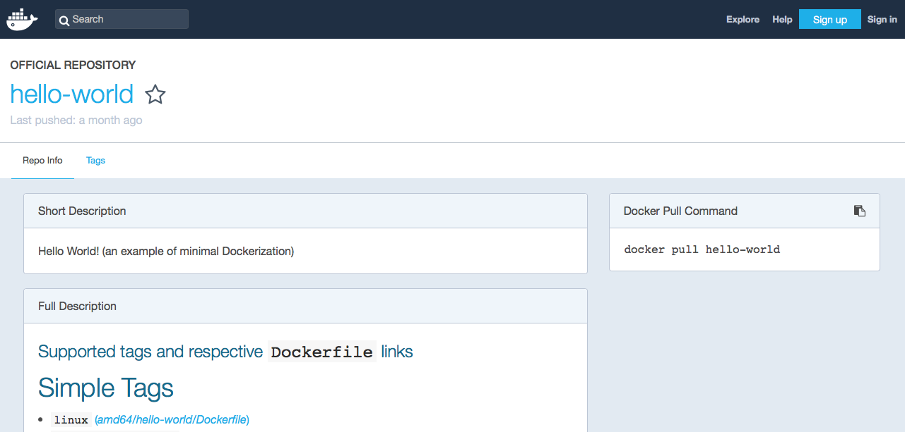

# IBM Kuberneteando sobre IBM Cloud Workshop
---
# Kuberneteando 2 Docker Hands On
---


Duration : 30 minutes

## Overview

In this lab, you will run your first Docker container.

Containers are just a process (or a group of processes) running in isolation. Isolation is achieved via linux namespaces and control groups. One thing to note, is that linux namespaces and control groups are features that are built into the linux kernel! Other than the linux kernel itself, there is nothing special about containers.

What makes containers useful is the tooling that surrounds it. For these labs, we will be using Docker, which has been the de facto standard tool for using containers to build applications. Docker provides developers and operators with a friendly interface to build, ship and run containers on any environment.

In this lab, we will run our first container, and learn how to inspect it. We will be able to witness the namespace isolation that we acquire from the linux kernel.

After we run our first container, we will dive into other uses of docker containers. We will find many examples of these on the Docker Store, and we will run several different types of containers on the same host. This will allow us to see the benefit of isolation- where we can run multiple containers on the same host without conflicts.

We will be using a few Docker commands in this lab. For full documentation on available commands check out the [official documentation](https://docs.docker.com/).

## Prerequisites
This set of instructions requires that docker is already installed and docker commands can be run from a bash shell or a command line. You can get more information at the [Docker website](https://www.docker.com/get-docker).
Alternatively, you can use [Play with Docker](http://play-with-docker.com).


## Task 1 - Working with Docker


### 1. Check Docker version

Launch a shell or a command line and confirm that docker is installed.

The version number isn't particularly important.
However, you can see both the client (CLI) and the server (engine).

`docker version`

Output:

```bash
# docker version
Client:
 Version:           18.06.2-ce
 API version:       1.38
 Go version:        go1.10.3
 Git commit:        6d37f41
 Built:             Sun Feb 10 03:48:06 2019
 OS/Arch:           linux/amd64
 Experimental:      false

Server:
 Engine:
  Version:          18.06.2-ce
  API version:      1.38 (minimum version 1.12)
  Go version:       go1.10.3
  Git commit:       6d37f41
  Built:            Sun Feb 10 03:46:30 2019
  OS/Arch:          linux/amd64
  Experimental:     false
```

The Docker version could be different. 


### 2. Run your first container

As with all new computer things, it is obligatory that we start with "hello-world"

`docker run hello-world`

Output:

```bash
# docker run hello-world
Unable to find image 'hello-world:latest' locally
latest: Pulling from library/hello-world
1b930d010525: Pull complete 
Digest: sha256:2557e3c07ed1e38f26e389462d03ed943586f744621577a99efb77324b0fe535
Status: Downloaded newer image for hello-world:latest

Hello from Docker!
This message shows that your installation appears to be working correctly.

To generate this message, Docker took the following steps:
 1. The Docker client contacted the Docker daemon.
 2. The Docker daemon pulled the "hello-world" image from the Docker Hub.
    (amd64)
 3. The Docker daemon created a new container from that image which runs the
    executable that produces the output you are currently reading.
 4. The Docker daemon streamed that output to the Docker client, which sent it
    to your terminal.

To try something more ambitious, you can run an Ubuntu container with:
 $ docker run -it ubuntu bash

Share images, automate workflows, and more with a free Docker ID:
 https://hub.docker.com/

For more examples and ideas, visit:
 https://docs.docker.com/get-started/
```

   

 > Notice the message `Unable to find image 'hello-world:latest' locally` First you see that the image was automatically downloaded without any additional commands. Second the version `:latest` was added to the name of the image. We did not specify a version for this image.


### 3. Rerun "hello-world" 

Notice that the image is not pulled down again. It already exists locally, so it is run.

`docker run hello-world`

Output:

```bash
# docker run hello-world

Hello from Docker!
This message shows that your installation appears to be working correctly.

To generate this message, Docker took the following steps:
 1. The Docker client contacted the Docker daemon.
 2. The Docker daemon pulled the "hello-world" image from the Docker Hub.
    (amd64)
 3. The Docker daemon created a new container from that image which runs the
    executable that produces the output you are currently reading.
 4. The Docker daemon streamed that output to the Docker client, which sent it
    to your terminal.

To try something more ambitious, you can run an Ubuntu container with:
 $ docker run -it ubuntu bash

Share images, automate workflows, and more with a free Docker ID:
 https://hub.docker.com/

For more examples and ideas, visit:
 https://docs.docker.com/get-started/
```


### 4.  Show the image

List all the images:

 `docker images hello-world`

Output:

```bash
# docker images
REPOSITORY          TAG                 IMAGE ID            CREATED             SIZE
hello-world         latest              fce289e99eb9        3 weeks ago         1.84kB
```


### 5. From where was the `hello-world` image pulled? 

Go to `https://hub.docker.com/_/hello-world/` and you can read about this image. Docker-hub is a registry that holds docker images for use. Docker-hub is not the only registry, IBM Cloud Public can serve as a docker registry. You can also have (or define) private registries.

 


### 6. Run a new container

This image is a typical image to get started with Docker. When an image is run it usually continues to run. 

The running image is called a **container**. Let us run a more typical image; This image contains the noSQL database **couchDB**. As there is no image containing couchDB on your laptop, you will first pull it from the Docker Hub and then once all the layers have been downloaded and extracted, you will run it.

`docker run -d redis`

Output:

```bash
# docker run -d redis
Unable to find image 'redis:latest' locally
latest: Pulling from library/redis
54fec2fa59d0: Pull complete 
9c94e11103d9: Pull complete 
04ab1bfc453f: Pull complete 
a22fde870392: Pull complete 
def16cac9f02: Pull complete 
1604f5999542: Pull complete 
```

 The output above was captured while the image was still downloading from docker-hub. When the download is complete,  you don't see anything from the container, like with hello-world. Instead you see a long hex id like `c610107837e8d0785a05fb22f1bcc16b21ce9b0d4ee96e82a28267676e4a6c27`. **This is the long id of the container**.

```bash
Digest: sha256:399a9b17b8522e24fbe2fd3b42474d4bb668d3994153c4b5d38c3dafd5903e32
Status: Downloaded newer image for redis:latest
c610107837e8d0785a05fb22f1bcc16b21ce9b0d4ee96e82a28267676e4a6c27
```

Also notice that the -d in the run command with launch the container as **detached** and so you can get the prompt when the command has been completed.


### 7. Look at the running container

Notice only the first part of that long hex id is displayed. Typically this is more than enough to uniquely identify that container. `docker ps` provides information about when the container was created, how long it has been running, then name of the image as well as the name of the container. Note that each container must have a unique name. You can specify a name for each container as long as it is unique.

`docker ps | grep redis` 

Output:

```bash
# docker ps
CONTAINER ID        IMAGE               COMMAND                  CREATED             STATUS              PORTS               NAMES
c610107837e8        redis               "docker-entrypoint.s…"   9 minutes ago       Up 9 minutes        6379/tcp            modest_hugle
```

You will notice that the name is auto-generated by Docker:  **modest_hugle**. So to avoid this, a good practice is to always give a name to a container with the **--name** parameter.


### 8. An image can be run multiple times 

Launch another container for the redis image with a given name.

`docker run --name redis2 -d redis`
Output:

```bash
# docker run --name redis2 -d redis
b07714e7b548dbb0d3911bb6a18c85f6e1043a34978aa60e1b7fb34d6439d9a1
```

Did you notice how quickly the second instance started? There was no need to download the image this time. The id of the container is show after is has started. You can notice that we are reusing all the layers already downloaded when we first pull the image.


### 9. Two redis containers  

`docker ps | grep redis`

Outpout:

```docker ps
CONTAINER ID        IMAGE               COMMAND                  CREATED              STATUS              PORTS               NAMES
b07714e7b548        redis               "docker-entrypoint.s…"   About a minute ago   Up About a minute   6379/tcp            redis2
c610107837e8        redis               "docker-entrypoint.s…"   13 minutes ago       Up 13 minutes       6379/tcp            modest_hugle
```


### 10. Similar redis instances 

The containers look similar, but they have unique names and unique ids. 

Stop the most recent container and then check to see what's running.

`docker stop c610107837e8 `

Output:

```bash
# docker stop c610107837e8
c610107837e8
```

Then check the container list. `-a` show all containers (default shows just running):

`docker ps -a

Output:

```bash
# docker ps -a
CONTAINER ID        IMAGE               COMMAND                  CREATED             STATUS                     PORTS               NAMES
b07714e7b548        redis               "docker-entrypoint.s…"   5 minutes ago       Up 5 minutes               6379/tcp            redis2
c610107837e8        redis               "docker-entrypoint.s…"   17 minutes ago      Exited (0) 2 minutes ago                       modest_hugle
```

So we still have one running container.

​    


### 11. Stop the other container

Stop the other container and see what is running.

 `docker stop b07714e7b548`

 `docker ps | grep redis` or `docker ps`

Output:

```bash
# docker ps
CONTAINER ID        IMAGE               COMMAND             CREATED             STATUS              PORTS               NAMES
```

We have no more redis running constainer.

 

### 12. What about the images

 Notice that the images still exist.

 `docker images`

Output:

```bash
# docker images
REPOSITORY          TAG                 IMAGE ID            CREATED             SIZE
redis               latest              f9b990972689        13 days ago         104MB
hello-world         latest              fce289e99eb9        3 weeks ago         1.84kB
```

>  You can filter the images by they names : `docker images redis`   

  

### 13. Now remove the redis image 

Go ahead and delete the couchDB image and double check that it is gone.

` docker rmi redis`

Output:

```bash
# docker rmi redis
Error response from daemon: conflict: unable to remove repository reference "couchdb" (must force) - container 272d409a806c is using its referenced image f9b990972689

```

Apparently some stopped containers are still using this images and you can see the ids.

   

### 14. Oops, it is not working

We can't delete that image until we delete the "redis" containers (running or not).

> Remember that the `docker ps -a` will show us all the containers, not just the ones that are running but also the ones that stopped.
You will noticed that all containers that you are listing have been stopped. 

`docker ps -a | grep redis`

Output:

```bash
# docker ps -a | grep redis
b07714e7b548        redis               "docker-entrypoint.s…"   17 minutes ago      Exited (0) 11 minutes ago                       redis2
c610107837e8        redis               "docker-entrypoint.s…"   29 minutes ago      Exited (0) 14 minutes ago                       modest_hugle

```

 

### 15. How to remove the image

Delete the stopped couchdb containers, delete the couchdb image, and make sure it is gone. You can leave hello-world.

`docker rm b07714e7b548 c610107837e8 `
Output:

```bash
# docker rm b07 c61
b07
c61

```

And use the rmi subcommand to remove the image:

 `docker rmi redis`

Output:

```bash
# docker rmi redis
Untagged: redis:latest
Untagged: redis@sha256:399a9b17b8522e24fbe2fd3b42474d4bb668d3994153c4b5d38c3dafd5903e32
Deleted: sha256:f9b9909726890b00d2098081642edf32e5211b7ab53563929a47f250bcdc1d7c
Deleted: sha256:7bd7286c61dee81eb691f022d070202ba2840574c460f6dcbc21792f8bf22a7f
Deleted: sha256:ba618723adf8eb28ec3d2b2003442599e3f947b4d66875b80dc6582c61f89a27
Deleted: sha256:cd3c331f934414f0d7a2a3ceb80935a54252dba553f1c1ee823961a07e8d1957
Deleted: sha256:09f9b5d7722b181ae2acd61396c20549afdea66ee31f921850191db5afe6738a
Deleted: sha256:3bd2921d0d3dd52dbcdc462f35b11cb89df901205284b0fea03c19bb8359907a
Deleted: sha256:c2adabaecedbda0af72b153c6499a0555f3a769d52370469d8f6bd6328af9b13
```

Notice that all the layers in the image have been gone.  

`docker ps -a | grep redis`

***Note:*** Docker images and containers can be referenced by **name** or by **id**. 


## 2. Task 2 - Running a web server


Let's run a container using the [official Nginx image](https://store.docker.com/images/nginx) from the Docker Store.

`docker container run --detach --publish 8080:80 --name nginx nginx`

```sh
$ docker container run --detach --publish 8080:80 --name nginx nginx
Unable to find image 'nginx:latest' locally
latest: Pulling from library/nginx
36a46ebd5019: Pull complete
57168433389f: Pull complete
332ec8285c50: Pull complete
Digest: sha256:c15f1fb8fd55c60c72f940a76da76a5fccce2fefa0dd9b17967b9e40b0355316
Status: Downloaded newer image for nginx:latest
5e1bf0e6b926bd73a66f98b3cbe23d04189c16a43d55dd46b8486359f6fdf048
```

    We are using a couple of new flags here. The `--detach` flag will run this container in the background. The `publish` flag publishes port 80 in the container (the default port for nginx), via port 8080 on our host. Remember that the NET namespace gives processes of the container their own network stack. The `--publish` flag is a feature that allows us to expose networking through the container onto the host.

    How do you know port 80 is the default port for nginx? Because it is listed in the [documentation](https://store.docker.com/images/nginx) on the Docker Store. In general, the documentation for the verified images is very good, and you will want to refer to them when running containers using those images.

    We are also specifying the `--name` flag, which names the container. 

    Since this is the first time you are running the nginx container, it will pull down the nginx image from the Docker Store. Subsequent containers created from the Nginx image will use the existing image located on your host.

    Nginx is a lightweight web server. You can access it on port 8080 on your localhost.

Access the nginx server on [localhost:8080](http://localhost:8080). If you are using play-with-docker, look for the `8080` link near the top of the page.


## Task 3 - Troubleshooting containers

###1. Troubleshooting containers  

To troubleshoot your container or your application, you may want to go inside the container to look at some logs or to see the processes.

`docker run -it ubuntu`

> -it : this concerns the interation with the container by using a bash shell.
>
> A prompt with the container id will be returned to you like : **root@6c0837ba95f6:/#**
>
> You can then type any kind of linux commands that are parts of the image.

Output:

```bash
# docker run -it ubuntu
root@cc88b7536a57:/# 
/ # ls
bin   dev   etc   home  proc  root  sys   tmp   usr   var
/ # ps -ef
PID   USER     TIME  COMMAND
    1 root      0:00 sh
    8 root      0:00 ps -ef
```


Don't forget to **exit** from the container:

`# exit`

For comparison, run `ps -ef` or `top` on the host. These commands will work on linux or mac. For windows, you can inspect the running processes using `tasklist`.

    ```sh
    root@cc88b7536a57:/# exit
    exit
    $ ps -ef
    # Lots of processes!
    ```
*Technical Deep Dive*
    PID is just one of the linux namespaces that provides containers with isolation to system resources. Other linux namespaces include:
    - MNT - Mount and unmount directories without affecting other namespaces
    - NET - Containers have their own network stack
    - IPC - Isolated interprocess communication mechanisms such as message queues.
    - User - Isolated view of users on the system
    - UTC - Set hostname and domain name per container

    These namespaces together provide the isolation for containers that allow them to run together securely and without conflict with other containers running on the same system. Next we will demonstrate different uses of containers. and the benefit of isolation as we run multiple containers on the same host.

    **Note**: Namespaces are a feature of the **linux** kernel. But Docker allows you to run containers on Windows and Mac... how does that work? The secret is that embedded in the Docker product is a linux subsystem. Docker open-sourced this linux subsystem to a new project: [LinuxKit](https://github.com/linuxkit/linuxkit). Being able to run containers on many different platforms is one advantage of using the Docker tooling with containers.

    In additional to running linux containers on Windows using a linux subsystem, native Windows containers are now possible due the creation of container primitives on the Windows OS. Native Windows containers can be run on Windows 10 or Windows Server 2016 or newer.


## Task 4 - Building Docker Images

A Dockerfile is a text file that has a series of instructions on how to build your image. It supports a simple set of commands that you need to use in your Dockerfile. There are several commands supported like FROM, CMD, ENTRYPOINT, VOLUME, ENV and more. We shall look at some of them.

Let us first start with the the overall flow, which goes something like this:

1. You create a Dockerfile with the required instructions.
2. Then you will use the docker build command to create a Docker image based on the Dockerfile that you created in step 1.

With this information, let us get going.

### Step 1: Create a python app (without using Docker)

Run the following command to create a file named `app.py` with a simple python program. (copy-paste the entire code block)

```bash
echo 'from flask import Flask

app = Flask(__name__)

@app.route("/")
def hello():
    return "hello world!"

if __name__ == "__main__":
    app.run(host="0.0.0.0")' > app.py
```

This is a simple python app that uses flask to expose a http web server on port 5000 (5000 is the default port for flask). Don't worry if you are not too familiar with python or flask, these concepts can be applied to an application written in any language.

**Optional:** If you have python and pip installed, you can run this app locally. If not, move on to the next step.

```sh
$ python3 --version
Python 3.6.1
$ pip3 --version
pip 9.0.1 from /usr/local/lib/python3.6/site-packages (python 3.6)
$ pip3 install flask
Requirement already satisfied: flask in /usr/local/lib/python3.6/site-packages
Requirement already satisfied: Werkzeug>=0.7 in /usr/local/lib/python3.6/site-packages (from flask)
Requirement already satisfied: itsdangerous>=0.21 in /usr/local/lib/python3.6/site-packages (from flask)
Requirement already satisfied: Jinja2>=2.4 in /usr/local/lib/python3.6/site-packages (from flask)
Requirement already satisfied: click>=2.0 in /usr/local/lib/python3.6/site-packages (from flask)
Requirement already satisfied: MarkupSafe>=0.23 in /usr/local/lib/python3.6/site-packages (from Jinja2>=2.4->flask)
johns-mbp:test johnzaccone$ pip3 install flask
Requirement already satisfied: flask in /usr/local/lib/python3.6/site-packages
Requirement already satisfied: itsdangerous>=0.21 in /usr/local/lib/python3.6/site-packages (from flask)
Requirement already satisfied: Jinja2>=2.4 in /usr/local/lib/python3.6/site-packages (from flask)
Requirement already satisfied: click>=2.0 in /usr/local/lib/python3.6/site-packages (from flask)
Requirement already satisfied: Werkzeug>=0.7 in /usr/local/lib/python3.6/site-packages (from flask)
Requirement already satisfied: MarkupSafe>=0.23 in /usr/local/lib/python3.6/site-packages (from Jinja2>=2.4->flask)
$ python3 app.py
 * Running on http://0.0.0.0:5000/ (Press CTRL+C to quit)
```

### Step 2: Create and build the Docker Image

If you don't have python install locally, don't worry! Because you don't need it. One of the advantages of using Docker containers is that you can build python into your containers, without having python installed on your host.

1. Create a `Dockerfile` but running the following command. (copy-paste the entire code block)

    ```sh
    echo 'FROM python:3.6.1-alpine
    RUN pip install flask
    CMD ["python","app.py"]
    COPY app.py /app.py' > Dockerfile
    ```

    A Dockerfile lists the instructions needed to build a docker image. Let's go through the above file line by line.

    **FROM python:3.6.1-alpine**
    This is the starting point for your Dockerfile. Every Dockerfile must start with a `FROM` line that is the starting image to build your layers on top of. In this case, we are selecting the `python:3.6.1-alpine` base layer since it already has the version of python and pip that we need to run our application. The `alpine` version means that it uses the alpine distribution, which is significantly smaller than an alternative flavor of linux. A smaller image means it will download (deploy) much faster, and it also has advantages for security because it has a smaller attack surface.

    Here we are using the "3.6.1-alpine" tag for the python image. Take a look at the available tags for the official python image on the [Docker Hub](https://hub.docker.com/_/python/). It is best practice to use a specific tag when inheriting a parent image so that changes to the parent dependency are controlled. If no tag is specified, the "latest" tag takes into effect, which is acts as a dynamic pointer that points to the latest version of an image.

    For security reasons, it is very important to understand the layers that you build your docker image on top of. For that reason, it is highly recommended to only use "official" images found in the [docker hub](https://hub.docker.com/), or non-community images found in the docker-store. These images are [vetted](https://docs.docker.com/docker-hub/official_repos/) to meet certain security requirements, and also have very good documentation for users to follow. You can find more information about this [python base image](https://store.docker.com/images/python), as well as all other images that you can use, on the [docker store](https://store.docker.com/).

    For a more complex application you may find the need to use a`FROM` image that is higher up the chain. For example, the parent [Dockerfile](https://github.com/docker-library/python/blob/88ba87d31a3033d4dbefecf44ce25aa1b69ab3e5/3.6/alpine/Dockerfile) for our python app  starts with `FROM alpine`, then specifies a series of `CMD` and `RUN` commands for the image. If you needed more fine-grained control, you could start with `FROM alpine` (or a different distribution) and run those steps yourself. To start off though, I recommend using an official image that closely matches your needs.

    **RUN pip install flask**
    The `RUN` command executes commands needed to set up your image for your application, such as installing packages, editing files, or changing file permissions. In this case we are installing flask. The `RUN` commands are executed at build time, and are added to the layers of your image.

    **CMD ["python","app.py"]**
    `CMD` is the command that is executed when you start a container. Here we are using `CMD` to run our python app.

    There can be only one `CMD` per Dockerfile. If you specify more thane one `CMD`, then the last `CMD` will take effect. The parent python:3.6.1-alpine also specifies a `CMD` (`CMD python2`). You can find the Dockerfile for the official python:alpine image [here](https://github.com/docker-library/python/blob/88ba87d31a3033d4dbefecf44ce25aa1b69ab3e5/3.6/alpine/Dockerfile).

    You can use the official python image directly to run python scripts without installing python on your host. But today, we are creating a custom image to include our source, so that we can build an image with our application and ship it around to other environments.

    **COPY app.py /app.py**
    This copies the app.py in the local directory (where you will run `docker image build`) into a new layer of the image. This instruction is the last line in the Dockerfile. Layers that change frequently, such as copying source code into the image, should be placed near the bottom of the file to take full advantage of the Docker layer cache. This allows us to avoid rebuilding layers that could otherwise be cached. For instance, if there was a change in the `FROM` instruction, it would invalidate the cache for all subsequent layers of this image. We will demonstrate a this little later in this lab.

    It seems counter-intuitive to put this after the `CMD ["python","app.py"]` line. Remember, the `CMD` line is executed only when the container is started, so we won't get a `file not found` error here.

    And there you have it: a very simple Dockerfile. A full list of commands you can put into a Dockerfile can be found [here](https://docs.docker.com/engine/reference/builder/). Now that we defined our Dockerfile, let's use it to build our custom docker image.

1. Build the docker image.

    Pass in `-t` to name your image `python-hello-world`.

    ```sh
    $ docker image build -t python-hello-world .
    Sending build context to Docker daemon  3.072kB
    Step 1/4 : FROM python:3.6.1-alpine
    3.6.1-alpine: Pulling from library/python
    acb474fa8956: Pull complete
    967ab02d1ea4: Pull complete
    640064d26350: Pull complete
    db0225fcac8f: Pull complete
    5432cc692c60: Pull complete
    Digest: sha256:768360b3fad01adffcf5ad9eccb4aa3ccc83bb0ed341bbdc45951e89335082ce
    Status: Downloaded newer image for python:3.6.1-alpine
    ---> c86415c03c37
    Step 2/4 : RUN pip install flask
    ---> Running in cac3222673a3
    Collecting flask
    Downloading Flask-0.12.2-py2.py3-none-any.whl (83kB)
    Collecting itsdangerous>=0.21 (from flask)
    Downloading itsdangerous-0.24.tar.gz (46kB)
    Collecting click>=2.0 (from flask)
    Downloading click-6.7-py2.py3-none-any.whl (71kB)
    Collecting Werkzeug>=0.7 (from flask)
    Downloading Werkzeug-0.12.2-py2.py3-none-any.whl (312kB)
    Collecting Jinja2>=2.4 (from flask)
    Downloading Jinja2-2.9.6-py2.py3-none-any.whl (340kB)
    Collecting MarkupSafe>=0.23 (from Jinja2>=2.4->flask)
    Downloading MarkupSafe-1.0.tar.gz
    Building wheels for collected packages: itsdangerous, MarkupSafe
    Running setup.py bdist_wheel for itsdangerous: started
    Running setup.py bdist_wheel for itsdangerous: finished with status 'done'
    Stored in directory: /root/.cache/pip/wheels/fc/a8/66/24d655233c757e178d45dea2de22a04c6d92766abfb741129a
    Running setup.py bdist_wheel for MarkupSafe: started
    Running setup.py bdist_wheel for MarkupSafe: finished with status 'done'
    Stored in directory: /root/.cache/pip/wheels/88/a7/30/e39a54a87bcbe25308fa3ca64e8ddc75d9b3e5afa21ee32d57
    Successfully built itsdangerous MarkupSafe
    Installing collected packages: itsdangerous, click, Werkzeug, MarkupSafe, Jinja2, flask
    Successfully installed Jinja2-2.9.6 MarkupSafe-1.0 Werkzeug-0.12.2 click-6.7 flask-0.12.2 itsdangerous-0.24
    ---> ce41f2517c16
    Removing intermediate container cac3222673a3
    Step 3/4 : CMD python app.py
    ---> Running in 2197e5263eff
    ---> 0ab91286958b
    Removing intermediate container 2197e5263eff
    Step 4/4 : COPY app.py /app.py
    ---> f1b2781b3111
    Removing intermediate container b92b506ee093
    Successfully built f1b2781b3111
    Successfully tagged python-hello-world:latest
    ```

    Verify that your image shows up in your image list via `docker image ls`.

```sh
$ docker image ls
REPOSITORY           TAG                 IMAGE ID            CREATED             SIZE
python-hello-world   latest              f1b2781b3111        26 seconds ago      99.3MB
python               3.6.1-alpine        c86415c03c37        8 days ago          88.7MB
```

Notice that your base image, python:3.6.1-alpine, is also in your list.

### Step 3: Run the Docker image

Now that you have built the image, you can run it to see that it works.

1. Run the Docker image

    ```sh
    $ docker run -p 5001:5000 -d python-hello-world
    0b2ba61df37fb4038d9ae5d145740c63c2c211ae2729fc27dc01b82b5aaafa26
    ```

    The `-p` flag maps a port running inside the container to your host. In this case, we are mapping the python app running on port 5000 inside the container, to port 5001 on your host. Note that if port 5001 is already in use by another application on your host, you may have to replace 5001 with another value, such as 5002.

1. Navigate to [localhost:5001](http://localhost:5001) in a browser to see the results.

    In play-with-docker, click the link `5001` that should appear near the top of your session. If all else fails: `curl localhost:5001` works...

    You should see "hello world!" on your browser.

1. Check the log output of the container.

    If you want to see logs from your application you can use the `docker container logs` command. By default, `docker container logs` prints out what is sent to standard out by your application. Use `docker container ls` to find the id for your running container.

    ```sh
    $ docker container logs [container id]
    * Running on http://0.0.0.0:5000/ (Press CTRL+C to quit)
    172.17.0.1 - - [28/Jun/2017 19:35:33] "GET / HTTP/1.1" 200 -
    ```

    The Dockerfile is how you create reproducible builds for your application. A common workflow is to have your CI/CD automation run `docker image build` as part of its build process. Once images are built, they will be sent to a central registry, where it can be accessed by all environments (such as a test environment) that need to run instances of that application. In the next step, we will push our custom image to the public docker registry: the docker hub, where it can be consumed by other developers and operators.

### Step 4: Push to a ibmcloud registry

I’m going to assume you have your ibmcloud CLI installed and working; if that’s not the case, take a look https://cloud.ibm.com/docs/cli/reference/ibmcloud?topic=cloud-cli-install-ibmcloud-cli#install_use and walk through the installation process.

Go ahead and log in to make sure you are authenticated against the back end that you’d like.

1. Login

    ```sh
    $ ibmcloud login --sso 
    Punto final de API: https://cloud.ibm.com
    Región: us-south
    
    Obtener un código de un solo uso de https://identity-2.eu-central.iam.cloud.ibm.com/identity/passcode para continuar
    ¿Desea abrir el URL en el navegador predeterminado? [Y/n] > y
    One Time Code > 
    Autenticando...
    Correcto
    ```

2. Using the IBM Cloud Container Registry

    Now let’s create a container registry name-space. You need to take a moment and think of something globally unique that is descriptive enough to tell you what it is. It is imperative that you do not put personal information in your container images, namespace names, description fields (for example, in registry tokens), or in any image configuration data (for example, image names or image labels).
    
    ```sh
    $ ibmcloud cr namespace-add lureyit
    Adding namespace 'lureyit'...
    Successfully added namespace 'lureyit'
    
    OK
    ```
    
    This command uses the container registry plugin to create the name space of lureyit in my ibmcloud account.

Luckily, IBM has created some short cuts for you. If we would like to push our container to the IBM Container Registry that we have created

Note: Don’t forget the . at the end, or wherever you have your Dockerfile – that’s how the build command knows where to run this.
    
    The Docker Hub naming convention is to tag your image with [dockerhub username]/[image name]. To do this, we are going to tag our previously created image `python-hello-world` to fit that format.

    ```sh
    $ docker tag python-hello-world [dockerhub username]/python-hello-world
    ok
    ```

1. Push your image to the registry

    Once we have a properly tagged image, we can use the `docker push` command to push our image to the Docker Hub registry.

    ```sh
    $ docker push [dockerhub username]/python-hello-world
    The push refers to a repository [docker.io/jzaccone/python-hello-world]
    2bce026769ac: Pushed
    64d445ecbe93: Pushed
    18b27eac38a1: Mounted from library/python
    3f6f25cd8b1e: Mounted from library/python
    b7af9d602a0f: Mounted from library/python
    ed06208397d5: Mounted from library/python
    5accac14015f: Mounted from library/python
    latest: digest: sha256:508238f264616bf7bf962019d1a3826f8487ed6a48b80bf41fd3996c7175fd0f size: 1786
    ```

1. Check out your image on docker hub in your browser

    Navigate to [Docker Hub](https://hub.docker.com) and go to your profile to see your newly uploaded image.

    Now that your image is on Docker Hub, other developers and operations can use the `docker pull` command to deploy your image to other environments.

    **Note:** Docker images contain all the dependencies that it needs to run an application within the image. This is useful because we no longer have deal with environment drift (version differences) when we rely on dependencies that are install on every environment we deploy to. We also don't have to go through additional steps to provision these environments. Just one step: install docker, and you are good to go.

## Step 5: Deploying a Change

The "hello world!" application is overrated, let's update the app so that it says "Hello Beautiful World!" instead.

1. Update `app.py`

    Replace the string "Hello World" with "Hello Beautiful World!" in `app.py`. You can update the file with the following command. (copy-paste the entire code block)

    ```bash
    echo 'from flask import Flask

    app = Flask(__name__)

    @app.route("/")
    def hello():
        return "hello beautiful world!"

    if __name__ == "__main__":
        app.run(host="0.0.0.0")' > app.py
    ```

1. Rebuild and push your image

    Now that your app is updated, you need repeat the steps above to rebuild your app and push it to the Docker Hub registry.

    First rebuild, this time use your Docker Hub username in the build command:

    ```sh
    $  docker image build -t [dockerhub username]/python-hello-world .
    Sending build context to Docker daemon  3.072kB
    Step 1/4 : FROM python:3.6.1-alpine
    ---> c86415c03c37
    Step 2/4 : RUN pip install flask
    ---> Using cache
    ---> ce41f2517c16
    Step 3/4 : CMD python app.py
    ---> Using cache
    ---> 0ab91286958b
    Step 4/4 : COPY app.py /app.py
    ---> 3e08b2eeace1
    Removing intermediate container 23a955e881fc
    Successfully built 3e08b2eeace1
    Successfully tagged jzaccone/python-hello-world:latest
    ```

    Notice the "Using cache" for steps 1-3. These layers of the Docker Image have already been built and `docker image build` will use these layers from the cache instead of rebuilding them.

    ```sh
    $ docker push [dockerhub username]/python-hello-world
    The push refers to a repository [docker.io/jzaccone/python-hello-world]
    94525867566e: Pushed
    64d445ecbe93: Layer already exists
    18b27eac38a1: Layer already exists
    3f6f25cd8b1e: Layer already exists
    b7af9d602a0f: Layer already exists
    ed06208397d5: Layer already exists
    5accac14015f: Layer already exists
    latest: digest: sha256:91874e88c14f217b4cab1dd5510da307bf7d9364bd39860c9cc8688573ab1a3a size: 1786
    ```

    There is a caching mechanism in place for pushing layers too. Docker Hub already has all but one of the layers from an earlier push, so it only pushes the one layer that has changed.

    When you change a layer, every layer built on top of that will have to be rebuilt. Each line in a Dockerfile builds a new layer that is built on the layer created from the lines before it. This is why the order of the lines in our Dockerfile is important. We optimized our Dockerfile so that the layer that is most likely to change (`COPY app.py /app.py`) is the last line of the Dockerfile. Generally for an application, your code changes at the most frequent rate. This optimization is particularly important for CI/CD processes, where you want your automation to run as fast as possible.

## Step 6: Understanding Image Layers

One of the major design properties of Docker is its use of the union file system.

Consider the Dockerfile that we created before:

```sh
FROM python:3.6.1-alpine
RUN pip install flask
CMD ["python","app.py"]
COPY app.py /app.py
```

Each of these lines is a layer. Each layer contains only the delta, or changes from the layers before it. To put these layers together into a single running container, Docker makes use of the union file system to overlay layers transparently into a single view.

Each layer of the image is read-only, except for the very top layer which is created for the container. The read/write container layer implements "copy-on-write" which means that files that are stored in lower image layers are pulled up to the read/write container layer only when edits are being made to those files. Those changes are then stored in the container layer. The "copy-on-write" function is very fast, and in almost all cases, does not have a noticeable effect on performance. You can inspect which files have been pulled up to the container level with the `docker diff` command. More information about how to use `docker diff` can be found [here](https://docs.docker.com/engine/reference/commandline/diff/).


Since image layers are read-only, they can be shared by images and by running containers. For instance, creating a new python app with its own Dockerfile with similar base layers, would share all the layers that it had in common with the first python app.

```sh
FROM python:3.6.1-alpine
RUN pip install flask
CMD ["python","app2.py"]
COPY app2.py /app2.py
```


You can also experience the sharing of layers when you start multiple containers from the same image. Since the containers use the same read-only layers, you can imagine that starting up containers is very fast and has a very low footprint on the host.

You may notice that there are duplicate lines in this Dockerfile and the Dockerfile you created earlier in this lab. Although this is a very trivial example, you can pull common lines of both Dockerfiles into a "base" Dockerfile, that you can then point to with each of your child Dockerfiles using the `FROM` command.

Image layering enables the docker caching mechanism for builds and pushes. For example, the output for your last `docker push` shows that some of the layers of your image already exists on the Docker Hub.

```sh
$ docker push [dockerhub username]/python-hello-world
The push refers to a repository [docker.io/jzaccone/python-hello-world]
94525867566e: Pushed
64d445ecbe93: Layer already exists
18b27eac38a1: Layer already exists
3f6f25cd8b1e: Layer already exists
b7af9d602a0f: Layer already exists
ed06208397d5: Layer already exists
5accac14015f: Layer already exists
latest: digest: sha256:91874e88c14f217b4cab1dd5510da307bf7d9364bd39860c9cc8688573ab1a3a size: 1786
```

To look more closely at layers, you can use the `docker image history` command of the python image we created.

```sh
$ docker image history python-hello-world
IMAGE               CREATED             CREATED BY                                      SIZE                COMMENT
f1b2781b3111        5 minutes ago       /bin/sh -c #(nop) COPY file:0114358808a1bb...   159B
0ab91286958b        5 minutes ago       /bin/sh -c #(nop)  CMD ["python" "app.py"]      0B
ce41f2517c16        5 minutes ago       /bin/sh -c pip install flask                    10.6MB
c86415c03c37        8 days ago          /bin/sh -c #(nop)  CMD ["python3"]              0B
<missing>           8 days ago          /bin/sh -c set -ex;   apk add --no-cache -...   5.73MB
<missing>           8 days ago          /bin/sh -c #(nop)  ENV PYTHON_PIP_VERSION=...   0B
<missing>           8 days ago          /bin/sh -c cd /usr/local/bin  && ln -s idl...   32B
<missing>           8 days ago          /bin/sh -c set -ex  && apk add --no-cache ...   77.5MB
<missing>           8 days ago          /bin/sh -c #(nop)  ENV PYTHON_VERSION=3.6.1     0B
<missing>           8 days ago          /bin/sh -c #(nop)  ENV GPG_KEY=0D96DF4D411...   0B
<missing>           8 days ago          /bin/sh -c apk add --no-cache ca-certificates   618kB
<missing>           8 days ago          /bin/sh -c #(nop)  ENV LANG=C.UTF-8             0B
<missing>           8 days ago          /bin/sh -c #(nop)  ENV PATH=/usr/local/bin...   0B
<missing>           9 days ago          /bin/sh -c #(nop)  CMD ["/bin/sh"]              0B
<missing>           9 days ago          /bin/sh -c #(nop) ADD file:cf1b74f7af8abcf...   4.81MB
```

Each line represents a layer of the image. You'll notice that the top lines match to your Dockerfile that you created, and the lines below are pulled from the parent python image. Don't worry about the "\<missing\>" tags. These are still normal layers; they have just not been given an ID by the docker system.

## Conclusion

Congratulations, you have successfully completed this Containers lab !  You've just build and run your first Docker-based web app !  In this lab, you learned how to build and run images on docker on your laptop.

---
# End of the lab
---
# IBM Hybrid Cloud Workshop
---
